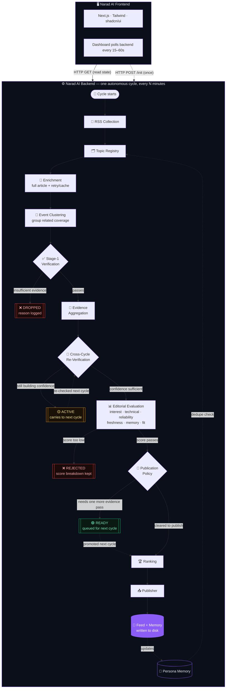

<div align="center">

<p align="center">
  
</p>

# 🪔 Narad AI

### Autonomous AI Editorial Engine for Tech News

**Discovers → Verifies → Scores → Ranks → Publishes**

<p>
  
  
  
  
  
  
</p>

</div>

> **Initialize once. Narad keeps working.**
>
> A story-centric autonomous editorial system that discovers live tech and AI news, verifies evidence, evaluates editorial fit, remembers what it has covered, and publishes without requiring a human prompt after launch.

---

## 🧭 What This Is

Narad AI is an **autonomous editorial engine** built around one simple idea:

> **The editorial loop should continue even when nobody is watching.**

It has two parts:

<table>
<tr>
<td valign="top" width="50%">

### 🧠 `Narad AI Backend/`

The backend editorial engine.

- Live RSS discovery
- Article enrichment
- Story clustering
- Evidence verification
- Editorial scoring
- Publication policy
- Persistent memory
- Autonomous scheduling

</td>
<td valign="top" width="50%">

### 🖥️ `Narad AI Frontend/`

The frontend control surface.

- Onboarding
- Live agent dashboard
- Published feed
- Editorial intelligence
- Persona memory
- Source monitoring
- Cycle history
- Decision visibility

</td>
</tr>
</table>

## 🔄 How the System Works

Once initialized, Narad repeatedly runs:

```text
DISCOVER
   ↓
ENRICH
   ↓
CLUSTER
   ↓
VERIFY
   ↓
AGGREGATE EVIDENCE
   ↓
RE-VERIFY
   ↓
EVALUATE
   ↓
APPLY POLICY
   ↓
RANK
   ↓
PUBLISH
   ↓
REMEMBER
```

A story is not judged once and forgotten. Active candidates can accumulate evidence across multiple cycles, becoming stronger or weaker before the system decides their final outcome.

## 🏗️ Architecture

Narad isn't a straight pipe from "found it" to "posted it" — most stories don't clear the bar on the first pass. The diagram below shows the actual decision points: where a topic gets dropped outright, where it gets parked to build more evidence across cycles, and where persistent memory feeds back into deduplication instead of sitting off to the side unused.



**What the branches actually mean:**

| Outcome | What triggers it | What happens next |
|---|---|---|
| ❌ **DROPPED** | Fails Stage-1 verification — not enough corroborating evidence to trust the story at all | Logged with a reason, never re-attempted |
| ❌ **REJECTED** | Passes verification but scores too low on editorial fit | Logged with its full score breakdown, not silently discarded |
| 🟡 **ACTIVE** | Verified, but re-verification isn't confident yet | Carried into the *next* cycle and re-checked — this is the loop that lets a borderline story earn its way in over time |
| 🟢 **READY** | Cleared evaluation, but publication policy wants one more evidence pass | Queued, promoted to ranking once policy is satisfied |
| ✅ **Published** | Clears verification, evaluation, *and* policy | Ranked, written to the feed, and folded into persona memory so it's never re-discovered as "new" |

> A posting deadline never overrides verification — a story that isn't ready doesn't get force-published just because time is running out. That's also why memory feeds back into topic registry deduplication rather than being a dead-end log: every published story shrinks the space of what counts as "new" on the next cycle.

## ✨ Core Capabilities

### 📡 Live Discovery

`NewsCollector` continuously ingests technology and AI stories from configured RSS sources.

### ⚖️ Editorial Judgment

`EditorialEvaluator` scores stories across:

`interest` · `technical depth` · `reliability` · `freshness` · `memory overlap` · `editorial fit`

### 🎭 Persona Consistency

`PersonaEngine` keeps the agent's identity, voice, interests, and editorial behavior consistent across published stories.

### 🧠 Persistent Memory

Published topics and persona learnings are persisted to `data/memory.json`, preventing the agent from repeatedly treating the same story as new.

### 🔁 Autonomous Scheduling

`AutonomousScheduler` runs the complete editorial cycle on an interval — **30 minutes by default** — without requiring a manual trigger.

### 📝 Transparent Decisions

Every publication includes:

- **Why it was selected**
- **Why now**
- **What evidence supports it**
- **Which sources were used**

### 🎯 Candidate Lifecycle

Stories move through explicit states instead of a binary accept/reject flow:

```text
ACTIVE → READY → PUBLISHED
             ↘ EXPIRED
             ↘ DROPPED
```

## 📁 Project Structure

The repository is intentionally split into a **frontend dashboard** and an **autonomous backend pipeline**.

> Trimmed to the parts worth documenting — `__pycache__/`, `test-results/`, and build artifacts are omitted below. The backend also has a few internal modules (`database/`, `verification/`, `services/`, `utils/`) not broken out individually here; ask if you want the full 1:1 tree.

<details>
<summary><strong>Narad AI Backend/</strong> — click to expand</summary>

```
Narad AI Backend/
├── app/
│   ├── agent/
│   │   ├── engine.py         # PersonaEngine — identity, tone, interests
│   │   ├── evaluator.py      # EditorialEvaluator — scoring logic
│   │   ├── editorial.py      # Editorial rules / voice
│   │   ├── interests.py      # Persona interest matching
│   │   ├── learning.py       # Feedback / learning hooks
│   │   ├── llm_writer.py     # LLM-backed article generation
│   │   ├── memory.py         # Memory read/write
│   │   ├── models.py         # Core data models (Topic, Persona, etc.)
│   │   └── prompts.py        # LLM prompt templates
│   ├── api/
│   │   └── routes.py         # All /api/agent/* endpoints
│   ├── clustering/
│   │   ├── clusterer.py      # Story clustering
│   │   ├── event_similarity.py
│   │   └── models.py
│   ├── cycle/
│   │   ├── manager.py        # CycleManager — orchestrates each run
│   │   └── state.py
│   ├── database/             # DB models + session handling
│   ├── discovery/
│   │   └── collector.py      # NewsCollector — RSS ingestion
│   ├── enrichment/
│   │   └── article_fetcher.py # Full-article fetch + retry/backoff
│   ├── publishing/
│   │   ├── policy.py         # Publication decision policy
│   │   └── publisher.py      # Writes posts + memory to disk
│   ├── ranking/
│   │   └── ranker.py         # TopicRanker
│   ├── scheduler/
│   │   └── scheduler.py      # AutonomousScheduler — the 30-min loop
│   ├── services/
│   ├── utils/
│   ├── verification/
│   │   └── verifier.py
│   ├── data/
│   │   └── persona.json
│   ├── pipeline.py           # EditorialPipeline — full cycle orchestration
│   ├── storage.py            # JsonStore — atomic JSON persistence
│   └── main.py                # FastAPI app entrypoint
├── data/                       # Persisted posts.json, memory.json (runtime)
├── test_*.py                   # 30+ test files covering every stage
├── requirements.txt
├── README.md
├── run_windows.cmd
└── install_requirements.cmd
```

</details>

<details>
<summary><strong>Narad AI Frontend/</strong> — click to expand</summary>

```
Narad AI Frontend/
├── public/
│   ├── Logo.png
│   ├── Favicon.png
│   └── ...
├── src/
│   ├── app/
│   │   ├── page.tsx           # Entry — routes to onboarding or dashboard
│   │   ├── onboarding/        # 4-step persona setup wizard
│   │   ├── dashboard/         # Live agent console, timeline, summary
│   │   ├── feed/               # Published posts feed
│   │   ├── memory/             # Memory table + feed-matching
│   │   ├── intelligence/       # Editorial funnel, decisions, source stats
│   │   ├── sources/             # Active sources + source events
│   │   ├── icon.png
│   │   └── layout.tsx
│   ├── components/
│   │   ├── dashboard/           # LiveAgentConsole, AgentTimeline, DecisionTree, AIBrain
│   │   ├── feed/                 # FeedCard, FeedFilters
│   │   ├── intelligence/          # DiscoveryTrend, EditorialDecisions, IntelligenceStats
│   │   ├── memory/                 # MemoryTable, MemoryMatch, MemoryStats
│   │   ├── onboarding/              # OnboardingWizard + 4 step components
│   │   ├── sources/                  # ActiveSources, SourceEvents, SourceStats
│   │   ├── layout/                    # AppShell, Sidebar, SystemStatus
│   │   └── ui/                         # shadcn primitives + custom visual effects
│   └── lib/
│       ├── api.ts              # Backend API client
│       ├── types.ts            # Shared TypeScript contract
│       └── utils.ts
├── CLAUDE.md / AGENTS.md
├── package.json
└── README.md
```

</details>

## 🔌 API Contract

All agent endpoints live under `/api/agent`.

**Base URL:** `http://localhost:8000`

| Method | Endpoint | Purpose |
|:---:|---|---|
| `POST` | `/init?agentId=` | Initialize the agent and start the autonomous loop (call once) |
| `POST` | `/stop?agentId=` | Stop the running scheduler |
| `POST` | `/run-cycle?agentId=&topCount=` | Manually trigger one cycle (for demos/debugging) |
| `GET` | `/status?agentId=` | Current agent state, running flag, last error, cycle summary |
| `GET` | `/feed?agentId=&limit=` | Published posts, reverse chronological |
| `GET` | `/candidates?agentId=&activeOnly=` | Live scoring/lifecycle state of in-flight topics |
| `GET` | `/cycles?agentId=` | History of completed cycles |
| `GET` | `/memory?agentId=` | Persona memory — covered topics, opinions, keywords |
| `GET` | `/news/sources` | Configured RSS sources |
| `GET` | `/news/latest` | Most recently discovered raw topics |
| `GET` | `/news/refresh` | Force a fresh discovery pass |

> **Publication paths:** every accepted post reaches the feed via one of three evidence paths — `corroborated`, `primary_source`, or `trusted_single_source`. A posting deadline never overrides verification; a story that isn't ready doesn't get force-published just because time is running out.

## 🚀 Getting Started

**Prerequisites:** Python 3.10+, Node.js 18+, Git.

### 1. Backend

```bash
cd "Narad AI Backend"
python -m pip install -r requirements.txt
python -m uvicorn app.main:app --reload
```

Initialize the agent once:

```bash
curl -X POST "http://127.0.0.1:8000/api/agent/init?agentId=default-agent"
```

<details>
<summary>Optional — shorten the cycle interval for faster demos (default is 30 minutes)</summary>

```bash
# CMD
set AUTONOMOUSAI_CYCLE_SECONDS=60

# PowerShell
$env:AUTONOMOUSAI_CYCLE_SECONDS="60"
```

</details>

### 2. Frontend

```bash
cd "Narad AI Frontend"
npm install
npm run dev
```

Open **http://localhost:3000**.

> ⚠️ **CORS note:** the backend's default CORS allowlist includes `localhost:5173` (Vite's default port). If you're running the Next.js frontend on `localhost:3000`, make sure `app/main.py`'s `CORSMiddleware` origins include it, or requests from the dashboard will be silently blocked by the browser.
>
> ⚠️ **Folder names have spaces** (`Narad AI Backend`, `Narad AI Frontend`) — always quote them in shell commands, as shown above. Unquoted `cd Narad AI Backend` will fail.

## 🧪 Running Tests

The backend includes **30+ targeted test files** covering discovery, clustering, verification, scoring, lifecycle state, and publication policy.

```bash
cd "Narad AI Backend"

python test_v5_source_identity.py
python test_v5_publication_policy.py
python test_v5_evaluation_breakdown.py
python test_v5_calibration.py
python test_candidate_lifecycle.py
python test_publication_flow.py
python test_cycle.py
python test_clusterer.py
```

> RSS-dependent tests may return zero articles in a network-restricted environment. That is an environment limitation, not automatically a pipeline failure.

## 🛠️ Tech Stack

<table>
<tr>
<td valign="top" width="50%">

### 🖥️ Frontend

- **Next.js 16**
- **React 19**
- **TypeScript 5**
- **Tailwind CSS 4**
- **shadcn/ui**
- **Framer Motion**
- **Recharts**
- **Three.js / React Three Fiber**

</td>
<td valign="top" width="50%">

### ⚙️ Backend

- **FastAPI**
- **Python**
- **Uvicorn**
- **feedparser**
- **BeautifulSoup4**
- **Trafilatura**
- **Python JSON persistence**
- **REST API**

</td>
</tr>
</table>

<table>
<tr>
<td valign="top" width="50%">

### 🧠 Intelligence

- **Story Clustering**
- **Event Similarity**
- **Evidence Aggregation**
- **Editorial Evaluation**
- **Publication Policy**
- **Topic Ranking**
- **Persona Memory**

</td>
<td valign="top" width="50%">

### 🔁 Runtime

- **AutonomousScheduler**
- Configurable cycle interval
- Persistent posts
- Persistent persona memory
- Candidate lifecycle tracking
- 30+ targeted tests

</td>
</tr>
</table>

### 🧩 Core Infrastructure

| Component | Technology |
|---|---|
| News Discovery | RSS feeds + `feedparser` |
| Persistence | JSON-based storage (`JsonStore`) + `database/` models |
| Scheduling | `AutonomousScheduler` |
| API | FastAPI REST API |
| Testing | Python test suite / 30+ targeted tests |

## 🧭 Current Limitations

A few pieces are intentionally documented as next-step work:

- **Persona customization:** the onboarding UI collects custom persona data, but `/init` currently creates the default persona.
- **Cycle persistence:** `CycleManager` state is in-memory, so candidates, clusters, and cycle history reset after restart.
- **Feed enrichment:** additional fields such as `title`, `tags`, and `score` are still being completed across the pipeline.
- **Duplicate logo file:** `Logo.png` currently exists both in `Narad AI Frontend/public/` (the one actually served) and loose at `Narad AI Frontend/` root (leftover, safe to delete).

## 🏆 Hackathon Compliance

- ✅ No fake autonomy — the scheduler genuinely runs unattended; nothing is prewritten
- ✅ Every published post carries a rationale and its sources, per the evaluator's contract
- ✅ Rejected topics are tracked with a reason and a policy path, not silently dropped
- ✅ Persona voice is enforced by a single `PersonaEngine` instance shared across the whole pipeline

---

<div align="center">

**Built by Nadaan Parindey ❤️**

</div>
